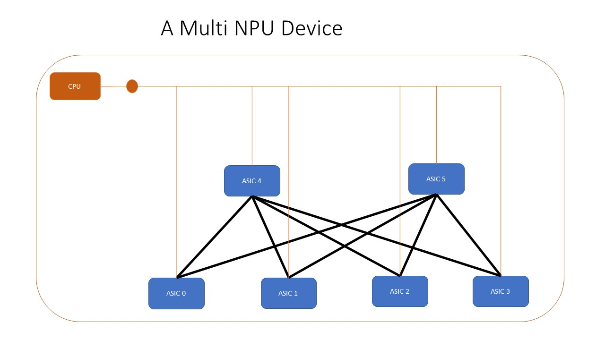
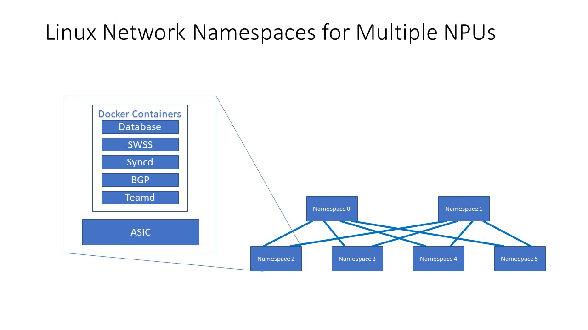
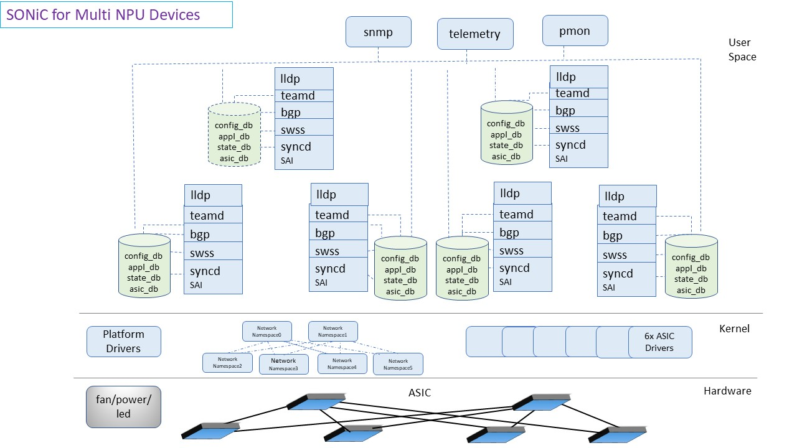
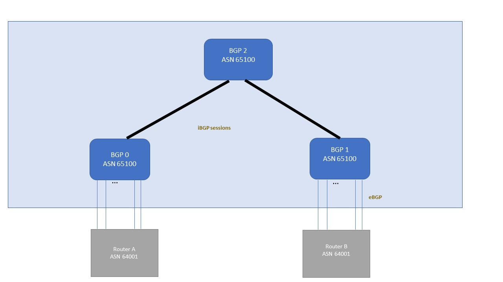
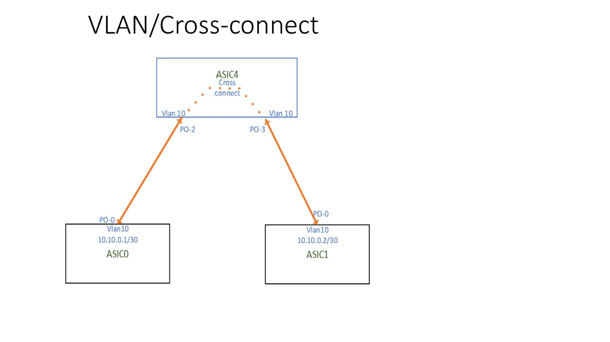

# SONiC on Multi NPU platforms
# High Level Design Document
## Rev 0.2
<!-- markdown-toc start - Don't edit this section. Run M-x markdown-toc-refresh-toc -->
**Table of Contents**

- [SONiC on Multi NPU platforms](#sonic-on-multi-npu-platforms)
- [High Level Design Document](#high-level-design-document)
    - [Rev 0.1](#rev-01)
    - [Revision](#revision)
    - [About this Manual](#about-this-manual)
    - [Architecture](#architecture)
        - [NPU roles](#npu-roles)
        - [Control Plane](#control-plane)
            - [iBGP](#ibgp)
            - [Vlan/Crossconnect](#vlancrossconnect)
        - [Module Design](#module-design)
            - [Configuration](#configuration)
            - [Systemd services](#systemd-services)
            - [Database Container](#database-container)
            - [Platform services](#platform-services)
            - [Montoring services](#montoring-services)
                - [SNMP](#snmp)
                - [Telemtry](#telemtry)
                - [Everflow](#everflow)
            - [QoS](#qos)
            - [CLI](#cli)
                - [Configuration commands](#configuration-commands)
                - [Operational Commands](#operational-commands)

<!-- markdown-toc end -->
  
    
## Revision
| Rev |     Date    |       Author       | Change Description                |
|:---:|:-----------:|:------------------:|-----------------------------------|
| 0.1 | 06/10/2020  |    Arvind          | Initial version                   |

## About this Manual

This document provides the high level design for supporting multi NPU platform in SONiC

## Architecture
A device or a platform with more than one NPU present on it is defined as multi NPU platform.
SONiC so far supports platforms with single NPU, we are enhancing SONiC to support multi NPU platforms

The figure below depicts a example of multi NPU platform. In this platform there are multi NPU interconnected with each other. 

To support multi NPU devices in SONiC a disaggregated design approach will be used. This means:
- Control plane containers, like bgp, lldp and teamd are replicated for every NPU on present on the device
- Data plane container like swss and syncd are also replicated per NPU.
   - Each instance is responsible for the programming a single NPU.
   - Each NPU is programmed and forwarding traffic independently
   - Each NPU has its own SAI
   
- A seperate database instance per NPU
  - Configuration is generated and stored per NPU.

To achieve this disaggregated design, a linux network namespace is created for every NPU.
Thereby creating a copy of network stack including routes and network devices for every NPU.
The interfaces for a given NPU is linked to a namespace.

All the control and data plane containers replicated per namespace.

### NPU roles

On multi NPU devices, each NPU can act as 
 - Frontend NPU, which connect to external devices. These NPU have some ports as frontpanel ports and some as internal ports.
 - Backend NPU, which have only internal links. These NPU only connect to other Frontend NPUs.
 
### Control Plane
Within Multi NPU SONiC system the way the control plane can be setup in following ways
#### iBGP 
In this approach:
- BGP instance is run on all the NPUs.
- iBGP sesssion are formed between each frontend and backend NPU.
- Route reflector are configured on the backend NPUs
- All the NPUs have same view of the network.

#### Vlan/Crossconnect
In this method:
- BGP is running only on the Frontend NPUs.
- The backend NPUs will switch packets using vlans or vlan-crossconnect.
- BGP session are formed between Frontend NPUs to form a mesh
- A unique VLAN is used for communication between a pair of Frontend NPU

### Module Design

#### Configuration

#### Systemd services

#### Database Container

#### Platform services

#### Montoring services

##### SNMP

##### Telemtry

##### Everflow

#### QoS

#### CLI

##### Configuration commands

##### Operational Commands
 
